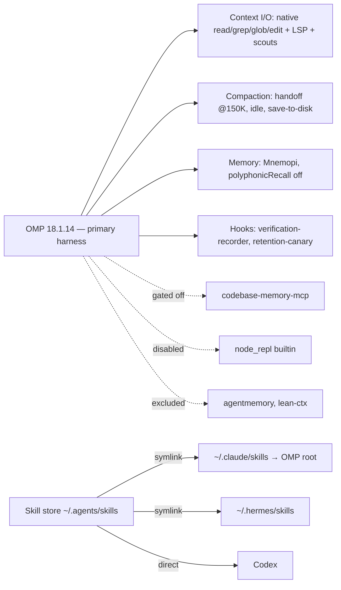

# Agent Stack — Decisions

> Sole operative doc. 2026-08-19: absorbed `AGENT_STACK.md` + `TOOLS_RESEARCH.md` (deleted); the frozen evidence ledger `AI_CONTEXT_TOOLING_COMPARISON.md` was deleted the same day — full evidence, grades, and methods live in its git history. Binding ADRs: `agentic-env/docs/adr/0006`–`0010`. Review standards: `CODING_STANDARDS.md`.
>
> Layout (2026-09-02): the summary table, the measured rules every layer cites, then one section per layer — **Decided → Why → Rejected → Revisit → Wiring** — so a reader can follow each decision from evidence to config line. Cross-cutting contract in "Live wiring", pre-registered triggers in "Upstream watch". Vocabulary: `docs/CONTEXT.md`.

## The stack

| Layer | Decided | Why | Alternatives | Revisit when |
|---|---|---|---|---|
| Harness | OMP | Best model + LSP + edit anchors | Hermes, Claude Code, opencode, Codex | Never unless OMP fails |
| Context I/O | OMP native only | Cache-stable, anchor-safe; compressors break edits | lean-ctx (removed, ADR-0009), Headroom, rtk | Native tools visibly fail |
| Compaction | handoff @ 150K, idle on, save-to-disk | −43–50% tokens, quality held | 120K threshold | End-green < 88% → revert |
| Memory | Mnemopi + retention-canary hook | Recall good, keyless, zero infra; canary covers silent-loss defect | Hindsight (sole challenger), mem0, agentmemory, Letta, Zep | Cross-project memory sharing needed → Hindsight |
| Code graph | codebase-memory-mcp gated off | Costs quality, 10× tokens | GitNexus, GraphRAG, Serena, etc. | Litmus fires weekly |
| Skills | Fit-curated roster (see Skills section): Pocock core + Ponytail forced + Caveman on demand + 9 pstack skills vendored | Fit-judged per recipe job; usage is diagnostic only | Full Pocock 25 + pstack 44 stores | A recipe step has no fitting skill; an Excluded trigger fires |
| Hooks | verification-recorder, retention-canary | Pass-rate read-outs; silent-memory-loss tripwire | cadence-governor (rejected 08-19), external monitoring | Recorder DB unread by next read-out; canary false-warns |

Agents around the stack: **OMP** is the primary harness (its wiring is the mandatory contract). **Hermes** is a supported agent (installed + configured; doctor warns). **Claude Code** and **Codex** are installed agents (pinned CLI + skills, nothing managed). Detail under Harness.

## Rules (measured; violations cost real money)

1. Judge by success-adjusted billed cost, never token reduction (correlation r=0.15).
2. Cache reads ≈ 68.6% of bill — a tool that can't touch cached re-reads can't move it.
3. No lossy compressor on the read→edit path (anchor corruption: patch success 27/40 → 15/40).
4. One semantic-memory owner per agent. OMP LSP owns live symbol truth.
5. Wiring routes tools; prose doesn't (3×-repeated prompt mandate → 15.6% adherence; cadence-governor nudges 16.4% ≈ chance).
6. Vendor claims measure at 1/8–1/3 of advertised, or negative — adopt only on locally measured, pre-registered endpoints.
7. Decisions live in committed docs; memory is convenience.
8. Skills are adopted on workflow fit (user judgment); usage audits are diagnostic — they flag stale or duplicate skills for re-review, never gate adoption. Rule 6 governs tools only. Usage units are canonical in `docs/CONTEXT.md`: user-invoked ≠ model-invoked ≠ string-scan.

What the rules bought: every rejection below names the pre-registered threshold it missed (lean-ctx 1 semantic call < 5; agentmemory 0 calls in 934 sessions; node_repl 0 calls; cadence-governor 16.4% adherence ≈ chance). The stack doctor enforces exactly what those verdicts left standing. Round 2 full-market sweep (17 tools, 08-11): 0 adoptions — no candidate ships 3P agent-on-repo evidence.

## Decisions by layer

### 1. Harness — OMP

- **Decided:** OMP, floor `18.1.14` (`stack_metadata.OMP_VERSION`; release assets and contract settings reviewed at `v18.1.14`; installer hash unchanged). The installer fetches the latest release binary and the floor is verified after install.
- **Why:** best model access + LSP + edit anchors. The alternatives lost on tooling, not on model.
- **Rejected as primary:** Hermes, Claude Code, opencode, Codex. A paired OMP/Hermes benchmark is parked — only if OMP-primary ever needs to be definitive.
- **Revisit:** never unless OMP fails. OMP major bump → re-verify converge keys against `packages/coding-agent/src/config/settings-schema.ts` at the new tag, raise the floor, re-run the docker smoke.
- **Wiring:** contract keys verified at the pinned tag: `memory.backend`, `compaction.{thresholdTokens,idleEnabled,handoffSaveToDisk,methodOrder}`, `skills.{enableClaudeUser,enableAgentsUser}`, `extensions`; drift check is block-scoped (`OMP_AGENT_CONFIG_CONTRACT`), not substring. `node_repl` built-in disabled on both OMP roots (0 calls; `OMP_GATED_BUILTINS`, doctor-enforced). MCP + skill roster bind at instance start: after any `mcp.json` edit → `/mcp reload` or restart live omp instances.

#### Agent tiers (2026-09-02)

- **Primary harness — OMP.** Installer-enforced, smoke-verified, doctor failure.
- **Supported agent — Hermes.** CLI, skills, MCP config, and health checks managed; doctor warns only (`TODO secondary`). Keeps `codebase-memory-mcp` + `agentmemory` entries (behaviour unmeasured).
- **Installed agent — Claude Code, Codex.** Latest CLI above the reviewed floor + curated skills via the skill store; no MCP config written or diagnosed; doctor warns only when the binary is missing.

#### Secondary agents TODO (closed 2026-09-02)

1. Hermes install correctness — **closed by `chore/agentic-env-bump-pins`**: reviewed release v2026.8.31 (`0.21.0`, `29112bef`); `_install_hermes` converges to `HERMES_COMMIT` on fresh or behind checkouts and leaves a checkout at or above the floor alone (the installer refuses rollbacks without `--force-commit`).
2. `agentmemory` + `codebase-memory-mcp` wiring on Claude/Codex — **not pursued**: Claude Code and Codex are installed agents; measured need for managed wiring is zero (agentmemory 0 calls in 934 sessions, codebase-memory litmus 0×). Hermes keeps its entries; the `@agentmemory/mcp` shim is pinned to `AGENTMEMORY_VERSION`.
3. Codex per-tool approval filters — **not pursued**: no managed Codex MCP config exists to filter.
4. Claude/Codex pin refresh — **closed by `chore/agentic-env-bump-pins`**: Codex 0.152.1, Claude 2.1.258, agentmemory 0.9.29; installer script checksums re-verified unchanged.

### 2. Context I/O — OMP native only

- **Decided:** OMP-native `read`/`grep`/`glob`/`edit` + LSP + scout subagents. Nothing sits on the read→edit path.
- **Why:** Rule 2 — cache reads are 68.6% of the bill and a compressor can't touch cached re-reads. Rule 3 — lossy compression corrupts edit anchors (patch success 27/40 → 15/40). Native is cache-stable and anchor-safe.
- **Rejected:**
  - lean-ctx — by its own pre-registered threshold (1 semantic call < 5; ADR-0008 fallback); removed stack-wide 2026-09-02 after containment failed twice (ADR-0009). Reinstall pointer ≥ 3.10.0 (never 3.9.x, lossy read-path default) in `stack_metadata.py`.
  - Headroom (+48.4% cost), rtk (wash), LLMLingua (degrades on code agents) — 3P evidence.
  - Context Mode, mcp-compressor, OmniRoute, pxpipe — duplicate native, unproven, or unneeded. aider repomap, Repomix — not pursued.
- **Revisit:** grep+LSP+scouts visibly fail on a real task → context I/O re-shop (Parked). Semantic search visibly missing → reinstall lean-ctx ≥ 3.10.0 with an OMP-native gated entry (ADR-0009), never the claude-import path.
- **Wiring:** read-interception prose has zero tolerance in any config OMP loads, including `~/.claude.json` `mcpServers.*.instructions` (doctor greps `ctx_` / `shadow mode` / `auto-route`). `lean-ctx` is purged **and** disabled on both OMP roots (`OMP_EXCLUDED_SERVERS`), must be absent from `~/.claude.json` (mandatory), and a stale Hermes entry warns.

### 3. Compaction — handoff @ 150K, idle on, save-to-disk

- **Decided:** `handoff` at 150K tokens, idle compaction on, handoff saved to disk.
- **Why:** −43–50% tokens with quality held.
- **Rejected:** 120K threshold (same quality, less headroom). The `handoff-as-deliberate-habit` skill — compaction covers fragmentation mechanically; "remember to invoke at seams" is prose, and prose doesn't route (Rule 5).
- **Revisit:** end-green < 88% → revert.
- **Wiring:** `compaction.{thresholdTokens,idleEnabled,handoffSaveToDisk,methodOrder}` in `~/.omp/agent/config.yml` (bak `config.yml.bak-tuning`).

### 4. Memory — Mnemopi + retention canary (settled 2026-08-19)

- **Decided:** Mnemopi stays default (user, 2026-08-11); the retention-canary hook covers its one defect.
- **Why:** recall good, keyless, zero infra. Stage 1 (08-11): zero-LLM Hindsight won the registered endpoint (decision-recall 1/4 @1,024 tok vs 0/4; cross-project isolation 4/4 PASS). Forensics (08-12): Mnemopi's 0/4 was a **silent retention gap**, not recall — zero retains 07-13→08-11 despite correct wiring. Stage 1b replay on the populated bank ≈ parity (1 PASS + 3 PARTIAL; reflect works keyless). Gap differential (08-17) ruled out version, cadence, config, drift, and hooks. Residual defects are opposite: Mnemopi = silent retention loss → **retention canary wired 08-18**; Hindsight = recall budget (config). Full data: `docs/memory-backend-research.md`.
- **Rejected:**
  - agentmemory on OMP — 0 calls in 934 sessions; ADR-0006 single memory owner. Stays on Hermes.
  - Hindsight — sole challenger; the one thing Mnemopi structurally cannot do is cross-project sharing.
  - mem0, MemPalace, Letta, Zep — unproven claims, wrong lane, or paid-only.
  - Stage 2 bake-off — skipped (user, 2026-08-19): was blocked on an OpenAI-compatible key; Stage 1b parity + the canary cover the residual risk. Unblock paths stay in the research doc if reopened.
- **Revisit:** related-project memory sharing becomes a live need → Hindsight (vs mem0 bake-off). Upstream https://github.com/can1357/oh-my-pi/issues/8940 (filed 2026-08-19: silent retention gap + differential; asks for retain-attempt telemetry) ships → retire the canary.
- **Wiring:** `memory.backend: mnemopi`; `mnemopi.polyphonicRecall: false` — the key lives under `mnemopi.`, not `memory.` (same in 17.0.5; template, host config, and drift check fixed 2026-09-02). `agentmemory` purged and disabled on both OMP roots and absent from `~/.claude.json`. Hermes: `mcp_servers.agentmemory` (`npx -y @agentmemory/mcp@<AGENTMEMORY_VERSION>`) + `memory.provider: agentmemory`.

### 5. Code graph — codebase-memory-mcp, wired but gated off

- **Decided:** installed and registered on both OMP roots, disabled by default; enabled per session only when the litmus fires.
- **Why:** costs quality and 10× tokens on ordinary tasks.
- **Litmus:** the task needs >10 native calls, crosses repo boundaries, or aggregates the whole graph → `/mcp enable` + `fast` reindex. Fired 0× since 08-05. Promotion: fires ~weekly in a project → default-on there.
- **Rejected:** GitNexus, GraphRAG, cognee, Graphiti, Semantica, Serena — no coding evidence, license, or paid.
- **Revisit:** litmus 0× by **2026-10-01** → remove `codebase-memory-mcp` from the OMP roots (keep installed for per-project on-demand mounting). Upstream 0.11.0 available vs floor 0.9.0; bump only on promotion.
- **Wiring:** `mcpServers: {codebase-memory-mcp}` gated by `disabledServers: [agentmemory, node_repl, codebase-memory-mcp, lean-ctx]` on `~/.omp/agent/mcp.json` and `~/.pi/agent/mcp.json` (`OMP_GATED_SERVERS`; bak `mcp.json.bak-leanctx-drop`, `.bak-gate`). Hermes wired too (unmeasured).

### 6. Skills — fit-curated roster (settled 2026-08-22; roles and recipes 2026-09-15)

- **Decided:** every installed skill is either **Core** (named in a recipe's default step) or an **Escalation** (runs only on its trigger); everything else is **Excluded** with its reopen condition. Criterion: fit for a named job, judged by the user (Rule 8, `docs/CONTEXT.md` _Adopted_). Usage history is a diagnostic footnote, never the criterion. Packs: Pocock (upstream tag), ponytail force-injected (tag), caveman on demand (tag), pstack **vendored** in this repo (`agentic_env/vendored/pstack`, ADR-0010).
- **Why:** measured — ponytail −10.3% cost (must force-inject), caveman −8.5% (on demand). Fit evidence: `docs/pocock-skills-fit-report.html`, `docs/pstack-skills-audit.html` (2026-08-20), `docs/skills-development-comparison.md` (2026-09-13, per-job Matt vs pstack; where its recommendations differ from this section, this section is operative). Invocation mode is a separate property from role: every pstack skill ships `disable-model-invocation: true` (`/`-only), Pocock/ponytail/caveman skills are model-invocable.
- **Roster (2026-09-15).** Recipe letters refer to the routing below.

  | Skill | Pack | Role | Job | Trigger → work product |
  |---|---|---|---|---|
  | wayfinder | Pocock | Core | entry routing for any multi-step task | — |
  | grilling, domain-modeling (= grill-with-docs) | Pocock | Core | B, D: settle behaviour, invariants, terms | → decision map, `CONTEXT.md` terms |
  | codebase-design | Pocock | Core | B, D: interface shape; loaded by `tdd` | → deep-module seams |
  | tdd | Pocock | Core | A, B when test-first is requested | → red-green at agreed seams |
  | diagnosing-bugs | Pocock | Core | C | → observable failure, narrowed cause |
  | code-review | Pocock | Core | A–D close: Standards (`CODING_STANDARDS.md`) + Spec axes | commit first (WIP fine): it diffs `<fixed-point>...HEAD` |
  | how | pstack | Core | E; A/C/D when the mechanism is unclear | → architectural explanation |
  | ponytail (+audit, debt, gain, help, review) | ponytail | Core | every task, force-injected | — |
  | research | Pocock | Escalation | B, E | external facts block a choice → findings file |
  | prototype | Pocock | Escalation | B | interaction or state model still uncertain → throwaway |
  | to-spec | Pocock | Escalation | B, D | work must survive a handoff → spec |
  | to-tickets | Pocock | Escalation | B, D, F | ≥ 2 independently verifiable slices → tickets |
  | resolving-merge-conflicts | Pocock | Escalation | any | conflict in progress → resolved tree |
  | handoff | Pocock | Escalation | any | context replacement (compaction covers it mechanically) → handoff doc |
  | teach | Pocock | Escalation | E | multi-session learning program wanted → lessons |
  | why | pstack | Escalation | C, D, E | historical intent affects the decision → sourced motivation |
  | blast-radius | pstack | Escalation | C, D | change touches lifecycle, concurrency, shared state, downstream → one safety fact proven by running code |
  | interrogate | pstack | Escalation | any close | consequential residual uncertainty after review → adversarial verdict |
  | unslop | pstack | Escalation | any prose deliverable | docs, PR body, report → cleaned text (dependency of show-me-your-work, reflect) |
  | create-verification-skill | pstack | Escalation | A, F | repo has no scripted user-journey check → project-local verification skill |
  | show-me-your-work | pstack | Escalation | F | someone must audit the run afterwards → decision log |
  | reflect | pstack | Escalation | any close | costly detour suggests a reusable fix → skill patch |
  | recall | pstack | Escalation | forensics | canary fire → read of the memory bank; never wired (Rule 4) |
  | caveman, caveman-commit | caveman | Escalation | any | terse output wanted → same content, fewer tokens |

- **Recipes** (routing guidance, never a mandatory chain; start from the task's unresolved uncertainty): **A** small well-specified change — read, state the acceptance condition, smallest change, exercise the real path, `code-review`; no spec, tickets, or retrospective. **B** uncertain feature — grill-with-docs, then `prototype`/`research` if still uncertain, `to-spec`/`to-tickets` if it must survive handoff, `codebase-design`, one vertical slice, review against the spec. **C** bug — `diagnosing-bugs`, `why` if intent matters, failing-before check (harness Verify rule), shared-cause fix, `blast-radius` if lifecycle/concurrency/shared state changed. **D** risky migration — `how` for producers/consumers, `why` for compatibility history, grilling for policy, `to-spec`/`to-tickets` for the cutover contract, codemod over hand edits, OMP-native fan-out for caller groups, `blast-radius`, remove obsolete paths. **E** unfamiliar repo or PR — `how`, narrow `why`, `research` for outside facts; end with the traced model, never a silent refactor. **F** long parallel delivery — falsifiable finish condition, `to-tickets`, OMP-native worktree fan-out with one integration owner, `show-me-your-work`, integrate and run the real behaviour, `reflect` only on a costly detour.
- **Excluded** (deliberately not installed; reopen condition stated):
  - `implement` (Pocock) — its pre-commit `/code-review` composes with the HEAD-ended diff and silently omits the WIP it was meant to review; the chain (tdd → tests → review → commit) is already the harness Verify rule. Replaced by the roster line "commit before `code-review`". Reopen: never (structural).
  - `architect` + `arena` (pstack) — `architect` needs `arena` and `how`, implements by default, and a four-agent panel on one model family is not four families. Reopen: a new module with ≥ 2 viable, structurally different shapes that are expensive to reverse → install both for that task only, run "design-only, checkpoint before code".
  - `swarm` (pstack) — OMP-native `task` batches with worktrees cover bounded coverage jobs. Reopen: a coverage job where native fan-out demonstrably fails.
  - pstack `tdd` — name collision with Pocock `tdd` in the flat store (`~/.agents/skills/<name>`, the CLI has no rename); its failing-before procedure is already the harness Verify rule. Reopen: Pocock `tdd` dropped.
  - pstack `teach` — collision with Pocock `teach`; the layered explanation it produces is `how`'s output. Reopen: never while `how` is installed.
  - `implement-spec` (Pocock, beta) — a second scheduler over the same ticket graph. Reopen: leaves beta and a full spec-to-one-PR run is wanted.
  - `retro` (Pocock, stub) — reopen: ships → fit audit against `reflect` (same job; keep one).
  - `principle-*` (pstack, 23) — `/`-only, so as skills they never warn unprompted; the six that fit are condensed into `CODING_STANDARDS.md` and applied by `code-review`'s Standards axis. Reopen: never as skills.
  - pstack style cluster (poteto-mode, laziness-protocol, subtract-before-you-add, minimize-reader-load, no-comments) — duplicates benchmarked ponytail/caveman; double style injection is paid prompt weight; no-comments contradicts load-bearing `ponytail:` ceiling markers. Novel fragments fold into ponytail text, never a second skill.
  - `grill-me` — grill-with-docs is a proven superset including non-code decisions. `writing-for-agents` — prose discipline, no mechanism; reopen if doc drift persists. `wait-what`, `to-questionnaire`, `ask-matt`, `wizard` — no recipe step names their job (wizard: no human-only provisioning step in any recipe). `graphify` — local one-off, outside packs.
- **Diagnostic footnote (usage, 08-22 raw DBs):** 567 OMP "sessions" = 226 main + 341 subagent; grill-with-docs 74 OMP / 215 Hermes user-invoked (413 = registry loads); tdd/code-review 0 user-invoked vs 108/320 model-invoked — the model reaches for them, the user never does, so nothing is forced to a slash command; `resolving-merge-conflicts`/`diagnosing-bugs` sat on measured pains (64+ conflicted merges, repeat-diagnosis loops) while structurally invisible to OMP (`enableAgentsUser: false`) — low use was availability, not misfit; `to-spec`/`to-tickets` 1 use each in 5 months, which the 08-22 pass read as misfit and the 09-15 pass re-read as "no recipe named their trigger". Counting units: `docs/CONTEXT.md`.
- **Revisit:** a recipe step with no fitting skill; an Excluded trigger firing; next fit audit.
- **Wiring:** curated at install time via `skill-packs.json` (packs list their skills explicitly; the `default` profile is the roster the doctor checks under `~/.claude/skills`, the root OMP loads). Upstream-pinned packs use `owner/repo#<tag>` in `source` (`mattpocock/skills#v1.2.3`; `JuliusBrussee/caveman#v2.3.1` — the benchmarked text, v2.4.0+ not taken; `DietrichGebert/ponytail#v4.9.0`). pstack is vendored: `source: ./vendored/pstack/skills`, resolved by the installer against the package directory and passed to the `skills` CLI as a local path; the copy's provenance (commit `c1c0a32`, 2026-09-14) is `agentic_env/vendored/pstack/UPSTREAM.md`, and `tests/test_install_skills_mcps.py` fails if the roster names a skill the copy lacks. `skills.enableClaudeUser: true` + `skills.enableAgentsUser: false` — `~/.agents/skills` is the skill store: the canonical copy that `~/.claude/skills` and `~/.hermes/skills` symlink into, loaded once via the Claude root. `enableClaudeUser` must be set explicitly: it defaults to `false` in the inspected OMP 18.1.13 schema, which silently left the whole pack invisible to OMP (found 2026-09-07 via missing `grill-with-docs`; only plugin + `~/.omp/agent/skills` skills loaded). Local one-off skills (graphify) live in the agent skill roots directly, outside packs. Review standards: `CODING_STANDARDS.md` next to this file.

### 7. Hooks — verification-recorder + retention-canary

- **Decided:** two hooks, `omp/hooks/verification-recorder.ts` and `omp/hooks/retention-canary.ts`.
- **Why:** pass-rate read-outs (OMP 527 verifications @ 87.3% pass; dedicated event tables beat string scans) and a silent-memory-loss tripwire (layer 4).
- **Rejected:**
  - cadence-governor (2026-08-19, measured non-adherence). Across 589 session logs: verification nudge 16.4% adherence within 10 calls, declining by fire number (17.5% → 10.6% → 8.7%) — at or below the ~22% chance rate of any 10-call window containing a verification command; overwrite-steer 15% immediate switch (n=20). The 08-11 read-out's sole positive signal (first-fire 59% verify ≤25 calls) came with 60% of all fired nudges being spam beyond N=75 — the 3-strike cap treated the symptom. Prose doesn't route (Rule 5). Reopen bar: a mechanism that routes (blocks/redirects) rather than nudges.
  - External monitoring — no mechanism inside the harness.
- **Revisit:** recorder DB unread by the next read-out; canary false-warns; canary fire-rate on 18.1.x read at the next read-out (zero fires and #8940 still open = keep); #8940 ships → retire the canary.
- **Observation (2026-09-09) → resolved 2026-09-15 (#43):** the canary reported an empty/never-retained bank while `recall` returned memories from it. Cause: `episodic_memory.created_at` is ISO `T…Z` while `working_memory`/`facts` use `YYYY-MM-DD HH:MM:SS`; the lexical SQL `max()` over the union picked the ISO row, the parser appended a second `Z`, `Date.parse` gave `NaN`, and `null` read as "never" — so the canary fired in every project with one episodic memory and two sessions. Fix: `max(julianday(created_at))` (both formats parsed and ordered numerically), regression test in `retention-canary.test.ts`. The Revisit trigger "canary false-warns" fired and is closed by this; the 07-19→08-10 gap it guards remains real.
- **Wiring:** each hook registered exactly once in `extensions:` with its file present (doctor-enforced). Hook files are diagnosed, never written (machine-provisioning boundary); the installer finds them via `$AGENTIC_DOTFILES_ROOT`, then `~/.dotfiles`, then the cwd/package ancestors, and refuses to seed `config.yml` without them (a half-seeded config is three doctor failures later).

## Live wiring (this machine)

Mandatory contract = the OMP layer. Installer-enforced (`agentic-configure-agent-mcps`), smoke-verified (`docker-smoke-test.sh`), diagnosed by `agentic-stack-doctor` (read-only; exit 1 only on an OMP check; Hermes wiring and the Hermes/Claude/Codex binaries warn with a TODO tag). The doctor runs as the last phase of `agentic-bootstrap` and `agentic-update-stack`.

- Clean-host contract (2026-09-02; version floors 2026-09-16): `uv tool install --force . && agentic-bootstrap` on a host with a `~/.dotfiles` checkout yields exactly this stack. Reviewed versions are **floors**, not pins (`STACK_VERSION_FLOORS`): installers fetch the latest release and verify it is at or above the floor, so a host ahead of the review is compliant and a host below it is a doctor failure. Skill/MCP/hook drift is never tolerated. Two components are still fetched at a fixed identity because their fetch path cannot be trusted to float: the Hermes installer (commit `95d42656`, #39) and the codebase-memory-mcp release archives (per-arch SHA256). Remote scripts stay hash-pinned regardless; the npm references install `@latest` and carry a written contract reason (`remote_install_contract`).
- Fresh-machine reproducibility: `agentic-configure-agent-mcps` seeds `~/.omp/agent/config.yml` from this contract when absent and verifies it when present (`converge_omp_agent_config`; existing user YAML is never rewritten).
- Configuration ownership (2026-09-10): notify-only for existing MCP definitions. Add missing entries; report mismatched commands/arguments and Hermes memory-provider conflicts for manual correction without rewriting the affected file. Existing OMP settings YAML remains read-only. The explicit OMP exclusion/default-gating policy is unchanged; it is not general repair authority.
- Hermes severity split (2026-09-13): `agentic-configure-agent-mcps` hard-fails on Hermes drift (it refuses an unsafe write to a user-owned file), while `agentic-stack-doctor` only warns for Hermes (it diagnoses a secondary agent; exit code is the OMP contract). Same drift, two verbs: refuse to write vs report.
- Acceptance scope (2026-09-10): native Apple Silicon macOS and Arch Linux x86_64, with the existing Debian container retained. Intel macOS is out of scope; direct CachyOS verification is deferred. An Arch run is Arch-family proxy evidence, not a verified CachyOS run; successful runs and exact OS/architecture coverage are recorded in the README.
- The concrete settings are the **Wiring** line of each layer above: harness (pin, contract keys, `node_repl`), context I/O (excluded servers, prose ban), compaction (`compaction.*`), memory (`memory.backend`, `mnemopi.polyphonicRecall`), code graph (`mcp.json` gate), skills (`skill-packs.json`, `skills.enableClaudeUser`, `skills.enableAgentsUser`), hooks (`extensions`).

## Upstream watch

Pre-registered triggers; nothing here is acted on without the trigger firing. Each is also the **Revisit** line of its layer.

- oh-my-pi #8940 (retain-attempt telemetry) ships → retire the retention canary.
- OMP major bump → re-verify converge keys against `settings-schema.ts` at the new tag, re-pin, re-run the docker smoke.
- Hermes installer (2026-09-15, #39): fetched at commit `95d42656` of `NousResearch/hermes-agent` (the bytes reviewed 2026-09-02), never from the floating `hermes-agent.nousresearch.com/install.sh`, which drifted 2026-09-13 and turned every acceptance job red. Hermes pin bump → move `HERMES_INSTALL_COMMIT` alongside it and re-verify the SHA256. `omp.sh/install` and `claude.ai/install.sh` remain floating + hash-pinned; first drift → same treatment if the vendor publishes a versioned URL.
- OMP installer (2026-09-15; re-scoped 2026-09-16): `scripts/install.sh:245` at the pinned SHA looks the release up on `api.github.com` unauthenticated; since the installer now runs without `--ref` that lookup is load-bearing rather than redundant. Shared `macos-15` runner IPs exhaust the 60 req/h limit → `curl 403`, macOS acceptance job red while Debian/Arch pass (six in a row 21:05–21:45 UTC on 2026-09-15). Not fixable here: `clean-acceptance.sh` forbids credentials in the smoke HOME by contract. Drop this line when upstream honours `GITHUB_TOKEN` or serves an unauthenticated latest-release redirect; re-verify `OMP_INSTALL_SHA256` then. Until then a red macOS job with that transcript is a re-run, not a defect.
- Canary fire-rate on 18.1.x → read at the next read-out; zero fires and #8940 still open = keep.
- codebase-memory litmus 0× by **2026-10-01** → remove `codebase-memory-mcp` from the OMP roots (keep installed for per-project on-demand mounting). Upstream 0.11.0 available vs floor 0.9.0; bump only on promotion (the archives are checksum-pinned, so this one does not float).
- mattpocock `retro` ships → fit audit against pstack `reflect` (same job; keep one).
- pstack vendored copy (`c1c0a32`, 2026-09-14) → re-copy only when a roster skill's upstream body fixes a defect hit here, or an Excluded trigger reopens a skill; each re-copy updates `UPSTREAM.md` and the commit in §6 Wiring. `cursor/plugins` starts tagging → switch `source` back to `cursor/plugins#<tag>` and delete the copy (ADR-0010 reopen).
- lean-ctx need fires (semantic search visibly missing on a real task) → reinstall ≥ 3.10.0 per ADR-0009.
- Cross-project memory becomes a live need → Hindsight vs mem0 bake-off.
- Trendshift screening: **Retired** as a routine (0 adoptions across two sweeps); on-demand reruns only.
- Version review → set every entry in `STACK_VERSION_FLOORS` to the latest stable release at the time of review, then re-run the acceptance matrix. Floors move on review, never on a single host's install.

## Parked

- Paired OMP/Hermes benchmark — only if OMP-primary ever needs to be definitive.
- Context I/O re-shop — only when grep+LSP+scouts visibly fail on a real task.
