# Agent Stack — Decisions

> Sole operative doc. 2026-08-19: absorbed `AGENT_STACK.md` + `TOOLS_RESEARCH.md` (deleted); the frozen evidence ledger `AI_CONTEXT_TOOLING_COMPARISON.md` was deleted the same day — full evidence, grades, and methods live in its git history. Binding ADRs: `agentic-env/docs/adr/0006`–`0010`. Review standards: `CODING_STANDARDS.md`.
>
> Layout (2026-09-02): the summary table, the measured rules every layer cites, then one section per layer — **Decided → Why → Rejected → Revisit → Wiring** — so a reader can follow each decision from evidence to config line. Cross-cutting contract in "Live wiring", pre-registered triggers in "Upstream watch". Vocabulary: `docs/CONTEXT.md`.

## The stack

| Layer | Decided | Why | Alternatives | Revisit when |
|---|---|---|---|---|
| Harness | OMP | Best model + LSP + edit anchors | Hermes, Claude Code, opencode, Codex | Never unless OMP fails |
| Context I/O | OMP native only | Cache-stable, anchor-safe; compressors break edits | lean-ctx (removed, ADR-0009), Headroom, rtk | Native tools visibly fail |
| Compaction | handoff @ 150K, idle on, save-to-disk | −43–50% tokens, quality held | 120K threshold | End-green < 88% → revert |
| Memory | Mnemopi + retention-canary hook | Recall good, keyless, zero infra; canary covers silent-loss defect | Hindsight (sole challenger), mem0, agentmemory, Letta, Zep | Cross-project memory sharing needed → Hindsight |
| Code graph | codebase-memory-mcp gated off | Costs quality, 10× tokens | GitNexus, GraphRAG, Serena, etc. | Litmus fires weekly |
| Skills | Fit-curated roster (see Skills section): Pocock core + Ponytail forced + Caveman on demand + 9 pstack skills vendored | Fit-judged per recipe job; usage is diagnostic only | Full Pocock 25 + pstack 44 stores | A recipe step has no fitting skill; an Excluded trigger fires |
| Hooks | verification-recorder, retention-canary | Pass-rate read-outs; silent-memory-loss tripwire | cadence-governor (rejected 08-19), external monitoring | Recorder DB unread by next read-out; canary false-warns |

```mermaid
flowchart LR
  OMP[OMP 18.1.14 — primary harness] --> IO[Context I/O: native read/grep/glob/edit + LSP + scouts]
  OMP --> CMP[Compaction: handoff @150K, idle, save-to-disk]
  OMP --> MEM[Memory: Mnemopi, polyphonicRecall off]
  OMP --> HK[Hooks: verification-recorder, retention-canary]
  OMP -.gated off.-> CG[codebase-memory-mcp]
  OMP -.disabled.-> NR[node_repl builtin]
  OMP -.excluded.-> AM[agentmemory, lean-ctx]
  SK[Skill store ~/.agents/skills] -->|symlink| CS[~/.claude/skills → OMP root]
  SK -->|symlink| HS[~/.hermes/skills]
  SK -->|direct| CX[Codex]
```

Agents around the stack: **OMP** is the primary harness (its wiring is the mandatory contract). **Hermes** is a supported agent (installed + configured; doctor warns). **Claude Code** and **Codex** are installed agents (pinned CLI + skills, nothing managed). Detail under Harness.

## Rules (measured; violations cost real money)

1. Judge by success-adjusted billed cost, never token reduction (correlation r=0.15).
2. Cache reads ≈ 68.6% of bill — a tool that can't touch cached re-reads can't move it.
3. No lossy compressor on the read→edit path (anchor corruption: patch success 27/40 → 15/40).
4. One semantic-memory owner per agent. OMP LSP owns live symbol truth.
5. Wiring routes tools; prose doesn't (3×-repeated prompt mandate → 15.6% adherence; cadence-governor nudges 16.4% ≈ chance).
6. Vendor claims measure at 1/8–1/3 of advertised, or negative — adopt only on locally measured, pre-registered endpoints.
7. Decisions live in committed docs; memory is convenience.
8. Skills are adopted on workflow fit (user judgment); usage audits are diagnostic — they flag stale or duplicate skills for re-review, never gate adoption. Rule 6 governs tools only. Usage units are canonical in `docs/CONTEXT.md`: user-invoked ≠ model-invoked ≠ string-scan.

What the rules bought: every rejection below names the pre-registered threshold it missed (lean-ctx 1 semantic call < 5; agentmemory 0 calls in 934 sessions; node_repl 0 calls; cadence-governor 16.4% adherence ≈ chance). The stack doctor enforces exactly what those verdicts left standing. Round 2 full-market sweep (17 tools, 08-11): 0 adoptions — no candidate ships 3P agent-on-repo evidence.

## Decisions by layer

### 1. Harness — OMP

- **Decided:** OMP, floor `18.1.14` (`stack_metadata.OMP_VERSION`; release assets and contract settings reviewed at `v18.1.14`; installer hash unchanged). The installer fetches the latest release binary and the floor is verified after install.
- **Why:** best model access + LSP + edit anchors. The alternatives lost on tooling, not on model.
- **Rejected as primary:** Hermes, Claude Code, opencode, Codex. A paired OMP/Hermes benchmark is parked — only if OMP-primary ever needs to be definitive.
- **Revisit:** never unless OMP fails. OMP major bump → re-verify converge keys against `packages/coding-agent/src/config/settings-schema.ts` at the new tag, raise the floor, re-run the docker smoke.
- **Wiring:** contract keys verified at the pinned tag: `memory.backend`, `compaction.{thresholdTokens,idleEnabled,handoffSaveToDisk,methodOrder}`, `skills.{enableClaudeUser,enableAgentsUser}`, `extensions`; drift check is block-scoped (`OMP_AGENT_CONFIG_CONTRACT`), not substring. `node_repl` built-in disabled on both OMP roots (0 calls; `OMP_GATED_BUILTINS`, doctor-enforced). MCP + skill roster bind at instance start: after any `mcp.json` edit → `/mcp reload` or restart live omp instances.

#### Agent tiers (2026-09-02)

- **Primary harness — OMP.** Installer-enforced, smoke-verified, doctor failure.
- **Supported agent — Hermes.** CLI, skills, MCP config, and health checks managed; doctor warns only (`TODO secondary`). Keeps `codebase-memory-mcp` + `agentmemory` entries (behaviour unmeasured).
- **Installed agent — Claude Code, Codex.** Latest CLI above the reviewed floor + curated skills via the skill store; no MCP config written or diagnosed; doctor warns only when the binary is missing.

#### Secondary agents TODO (closed 2026-09-02)

1. Hermes install correctness — **closed by `chore/agentic-env-bump-pins`**: reviewed release v2026.8.31 (`0.21.0`, `29112bef`); `_install_hermes` converges to `HERMES_COMMIT` on fresh or behind checkouts and leaves a checkout at or above the floor alone (the installer refuses rollbacks without `--force-commit`).
2. `agentmemory` + `codebase-memory-mcp` wiring on Claude/Codex — **not pursued**: Claude Code and Codex are installed agents; measured need for managed wiring is zero (agentmemory 0 calls in 934 sessions, codebase-memory litmus 0×). Hermes keeps its entries; the `@agentmemory/mcp` shim is pinned to `AGENTMEMORY_VERSION`.
3. Codex per-tool approval filters — **not pursued**: no managed Codex MCP config exists to filter.
4. Claude/Codex pin refresh — **closed by `chore/agentic-env-bump-pins`**: Codex 0.152.1, Claude 2.1.258, agentmemory 0.9.29; installer script checksums re-verified unchanged.

### 2. Context I/O — OMP native only

- **Decided:** OMP-native `read`/`grep`/`glob`/`edit` + LSP + scout subagents. Nothing sits on the read→edit path.
- **Why:** Rule 2 — cache reads are 68.6% of the bill and a compressor can't touch cached re-reads. Rule 3 — lossy compression corrupts edit anchors (patch success 27/40 → 15/40). Native is cache-stable and anchor-safe.
- **Rejected:**
  - lean-ctx — by its own pre-registered threshold (1 semantic call < 5; ADR-0008 fallback); removed stack-wide 2026-09-02 after containment failed twice (ADR-0009). Reinstall pointer ≥ 3.10.0 (never 3.9.x, lossy read-path default) in `stack_metadata.py`.
  - Headroom (+48.4% cost), rtk (wash), LLMLingua (degrades on code agents) — 3P evidence.
  - Context Mode, mcp-compressor, OmniRoute, pxpipe — duplicate native, unproven, or unneeded. aider repomap, Repomix — not pursued.
- **Revisit:** grep+LSP+scouts visibly fail on a real task → context I/O re-shop (Parked). Semantic search visibly missing → reinstall lean-ctx ≥ 3.10.0 with an OMP-native gated entry (ADR-0009), never the claude-import path.
- **Wiring:** read-interception prose has zero tolerance in any config OMP loads, including `~/.claude.json` `mcpServers.*.instructions` (doctor greps `ctx_` / `shadow mode` / `auto-route`). `lean-ctx` is purged **and** disabled on both OMP roots (`OMP_EXCLUDED_SERVERS`), must be absent from `~/.claude.json` (mandatory), and a stale Hermes entry warns.

### 3. Compaction — handoff @ 150K, idle on, save-to-disk

- **Decided:** `handoff` at 150K tokens, idle compaction on, handoff saved to disk.
- **Why:** −43–50% tokens with quality held.
- **Rejected:** 120K threshold (same quality, less headroom). The `handoff-as-deliberate-habit` skill — compaction covers fragmentation mechanically; "remember to invoke at seams" is prose, and prose doesn't route (Rule 5).
- **Revisit:** end-green < 88% → revert.
- **Wiring:** `compaction.{thresholdTokens,idleEnabled,handoffSaveToDisk,methodOrder}` in `~/.omp/agent/config.yml` (bak `config.yml.bak-tuning`).

### 4. Memory — Mnemopi + retention canary (settled 2026-08-19)

- **Decided:** Mnemopi stays default (user, 2026-08-11); the retention-canary hook covers its one defect.
- **Why:** recall good, keyless, zero infra. Stage 1 (08-11): zero-LLM Hindsight won the registered endpoint (decision-recall 1/4 @1,024 tok vs 0/4; cross-project isolation 4/4 PASS). Forensics (08-12): Mnemopi's 0/4 was a **silent retention gap**, not recall — zero retains 07-13→08-11 despite correct wiring. Stage 1b replay on the populated bank ≈ parity (1 PASS + 3 PARTIAL; reflect works keyless). Gap differential (08-17) ruled out version, cadence, config, drift, and hooks. Residual defects are opposite: Mnemopi = silent retention loss → **retention canary wired 08-18**; Hindsight = recall budget (config). Full data: `docs/memory-backend-research.md`.
- **Rejected:**
  - agentmemory on OMP — 0 calls in 934 sessions; ADR-0006 single memory owner. Stays on Hermes.
  - Hindsight — sole challenger; the one thing Mnemopi structurally cannot do is cross-project sharing.
  - mem0, MemPalace, Letta, Zep — unproven claims, wrong lane, or paid-only.
  - Stage 2 bake-off — skipped (user, 2026-08-19): was blocked on an OpenAI-compatible key; Stage 1b parity + the canary cover the residual risk. Unblock paths stay in the research doc if reopened.
- **Revisit:** related-project memory sharing becomes a live need → Hindsight (vs mem0 bake-off). Upstream https://github.com/can1357/oh-my-pi/issues/8940 (filed 2026-08-19: silent retention gap + differential; asks for retain-attempt telemetry) ships → retire the canary.
- **Wiring:** `memory.backend: mnemopi`; `mnemopi.polyphonicRecall: false` — the key lives under `mnemopi.`, not `memory.` (same in 17.0.5; template, host config, and drift check fixed 2026-09-02). `agentmemory` purged and disabled on both OMP roots and absent from `~/.claude.json`. Hermes: `mcp_servers.agentmemory` (`npx -y @agentmemory/mcp@<AGENTMEMORY_VERSION>`) + `memory.provider: agentmemory`.

### 5. Code graph — codebase-memory-mcp, wired but gated off

- **Decided:** installed and registered on both OMP roots, disabled by default; enabled per session only when the litmus fires.
- **Why:** costs quality and 10× tokens on ordinary tasks.
- **Litmus:** the task needs >10 native calls, crosses repo boundaries, or aggregates the whole graph → `/mcp enable` + `fast` reindex. Fired 0× since 08-05. Promotion: fires ~weekly in a project → default-on there.
- **Rejected:** GitNexus, GraphRAG, cognee, Graphiti, Semantica, Serena — no coding evidence, license, or paid.
- **Revisit:** litmus 0× by **2026-10-01** → remove `codebase-memory-mcp` from the OMP roots (keep installed for per-project on-demand mounting). Upstream 0.11.0 available vs floor 0.9.0; bump only on promotion.
- **Wiring:** `mcpServers: {codebase-memory-mcp}` gated by `disabledServers: [agentmemory, node_repl, codebase-memory-mcp, lean-ctx]` on `~/.omp/agent/mcp.json` and `~/.pi/agent/mcp.json` (`OMP_GATED_SERVERS`; bak `mcp.json.bak-leanctx-drop`, `.bak-gate`). Hermes wired too (unmeasured).

### 6. Skills — fit-curated roster (implementation approved 2026-09-21)

- **Decided:** 38 curated skills: **19 Matt + 11 pstack + 6 ponytail + 2 caveman**. Roles remain Core, Escalation and Excluded, judged by fit for a named job rather than usage counts. Matt and pstack are complete vendored packages with immutable upstream provenance and documented local OMP/Hermes adaptations; ponytail and caveman retain their reviewed tags.
- **Why:** measured style choices remain ponytail −10.3% cost (force-injected) and caveman −8.5% (on demand). Earlier fit reports remain historical; `docs/skills-workflow-recheck-2026-09-21.md` records the reassessment, subsequent approval and exercised implementation evidence. This section is operative where earlier recommendations differ.
- **Invocation:** all eleven pstack skills remain manual-only. Matt's `grill-with-docs`, `handoff`, `improve-codebase-architecture`, `teach`, `to-spec`, `to-tickets`, `wait-what`, `wayfinder` and `wizard` are manual-only; the other ten keep narrow automatic triggers, including `writing-for-agents` for agent-facing documents. Explicitly invoked recipes may load named dependencies. Role and recipe references do not override invocation or action permissions. OMP 18.2.8 hides manual metadata from its automatic listing while preserving named loading. Installed Hermes does not honor that flag in its catalog: `Manual only:` descriptions and body guards are behavioral boundaries, not enforced catalog hiding.
- **Roster (2026-09-21).** Recipe letters refer to the routing below.

  | Skill | Pack | Role | Job | Trigger → work product |
  |---|---|---|---|---|
  | wayfinder | Pocock | Escalation | multi-session decision uncertainty | explicit routing request → durable workspace; not a prerequisite for direct work |
  | grilling, grill-with-docs, domain-modeling | Pocock | Core | B, D: settle behaviour, invariants, terms | → decision map, `CONTEXT.md` terms |
  | codebase-design | Pocock | Core | B, D: interface shape; loaded by `tdd` | → deep-module seams |
  | tdd | Pocock | Core | A, B when test-first is requested | → red-green at agreed seams |
  | diagnosing-bugs | Pocock | Core | C | → observable failure, narrowed cause |
  | code-review | Pocock | Core | A–D: Standards (`CODING_STANDARDS.md`) + Spec review | → one frozen `refs` or explicitly scoped `wip` snapshot; no commit-first requirement |
  | how | pstack | Core | E; A/C/D when the mechanism is unclear | → architectural explanation |
  | ponytail (+audit, debt, gain, help, review) | ponytail | Core | every task, force-injected | — |
  | research | Pocock | Escalation | B, E | external facts block a choice → findings file |
  | prototype | Pocock | Escalation | B | interaction or state model still uncertain → throwaway |
  | to-spec | Pocock | Escalation | B, D | work must survive a handoff → spec |
  | to-tickets | Pocock | Escalation | B, D, F | ≥ 2 independently verifiable slices → tickets |
  | resolving-merge-conflicts | Pocock | Escalation | any | conflict in progress → resolved tree |
  | handoff | Pocock | Escalation | any | context replacement (compaction covers it mechanically) → handoff doc |
  | teach | Pocock | Escalation | E | explicitly requested personal learning → lessons; not course/notebook authoring |
  | why | pstack | Escalation | C, D, E | historical intent affects the decision → sourced motivation |
  | blast-radius | pstack | Escalation | C, D | change touches lifecycle, concurrency, shared state, downstream → one safety fact proven by running code |
  | interrogate | pstack | Escalation | consequential residual uncertainty | explicit request → adversarial reviews of the same frozen input, with actual returned provider/model identities |
  | unslop | pstack | Escalation | targeted prose cleanup | explicit request or named recipe dependency → cleaned text; never globally injected |
  | create-verification-skill | pstack | Escalation | A, F | missing reusable user-journey check → project-local `.agents/skills/verify-<app>`; prove one mapped feature |
  | maintain-verification-skill | pstack | Escalation | existing mapped verifier drifts | explicit request → exercise every mapped feature, update only that verifier; report product regressions |
  | technical-writing | pstack | Escalation | substantial human/learner-facing material | explicit request → audience-shaped outline, researched and revised text |
  | writing-for-agents | Pocock | Escalation | agent-facing documents | narrow automatic trigger → useful context pointers and invocation-aware skills |
  | improve-codebase-architecture | Pocock | Escalation | architecture survey | explicit request → ranked opportunities; no product edits or mandatory lone worker |
  | wizard | Pocock | Escalation | human-only setup or cutover | explicit request and approved stages/destinations → script for the human to execute; no secret survey or automatic execution |
  | wait-what | Pocock | Escalation | unclear prior explanation | explicit request → concrete clarification |
  | show-me-your-work | pstack | Escalation | F | someone must audit the run afterwards → decision log |
  | reflect | pstack | Escalation | any close | costly detour suggests a reusable fix → skill patch |
  | recall | pstack | Escalation | historical conversations | explicit question → scoped, source-backed transcript retrieval; distinct from the native memory tool of the same name |
  | caveman, caveman-commit | caveman | Escalation | any | terse output wanted → same content, fewer tokens |

- **Recipes** (routing choices, never a mandatory chain): **A** known small change — read, state acceptance, make the smallest change and exercise the affected real path; review when requested or warranted. **B** uncertain feature — grilling/grill-with-docs, then prototype or research for unresolved facts; durable specs/tickets only when needed, interface design and one vertical slice. **C** bug — diagnose, recover intent with `why` when relevant, failing-before check, shared-cause fix; use `blast-radius` for lifecycle/concurrency/shared-state risk. **D** risky migration — trace producers/consumers with `how`, establish compatibility policy, record the cutover contract, partition independent caller groups and verify downstream safety. **E** explanation/learning — `how` for mechanism, `why` for rationale, `wait-what` for clarification; Matt `teach` only for personal learning, research + technical writing + runnable material for authoring. **F** long parallel delivery — falsifiable finish condition, independent slices with one integration owner, current-run audit when requested, real runtime verification; reflect only on a costly detour. Routine work checks affected paths, not automatic full-map verifier maintenance.
- **Excluded** (deliberately not installed; reopen condition stated):
  - `implement` (Pocock) — the approved direct-work route does not need its orchestrator or unconditional commit behavior. The unadapted installed copy was removed. WIP review is fixed at `code-review`, not worked around by committing first. Reopen only for an explicitly wanted orchestrator with bounded publication authority.
  - `architect` + `arena` (pstack) — `architect` implements by default; same-model workers do not establish model diversity. Reopen for an expensive, reversible design choice needing their full method, with an explicit design-only stop.
  - `swarm` (pstack) — no approved need for another coverage orchestrator. Native task batches are available, not a claim of equivalence to its full method. Reopen when that coverage method is specifically needed.
  - pstack `tdd` — public-name collision with Matt's selected `tdd`. No second public name and no approval to fold the full pstack regression contract into Matt's method. Existing diagnosis and failing-before verification remain; reopen only on an explicit method decision.
  - pstack `teach` — public-name collision with Matt's selected personal-learning method. Its complete teaching contract was not folded into Matt's method or claimed equivalent to `how`; reopen on an explicit teaching-method decision.
  - `implement-spec` (Pocock, beta) — a second scheduler over the same ticket graph. Reopen: leaves beta and a full spec-to-one-PR run is wanted.
  - `retro` (Pocock, beta) — body and beta maturity label disagree; not adopted. Reopen for a focused fit comparison with `reflect` when its maturity is clear.
  - `principle-*` (pstack, 23) — `/`-only, so as skills they never warn unprompted; the six that fit are condensed into `CODING_STANDARDS.md` and applied by `code-review`'s Standards axis. Reopen: never as skills.
  - pstack style cluster (poteto-mode, laziness-protocol, subtract-before-you-add, minimize-reader-load, no-comments) — duplicates benchmarked ponytail/caveman; double style injection is paid prompt weight; no-comments contradicts load-bearing `ponytail:` ceiling markers. Novel fragments fold into ponytail text, never a second skill.
  - `grill-me` — existing interview methods cover the selected job. `bro` — `wait-what` is the chosen clarification entry. `to-questionnaire`, `ask-matt` — no approved job. `graphify` — existing local one-off, outside the curated packs.
- **Diagnostic footnote (usage, 08-22 raw DBs):** 567 OMP "sessions" = 226 main + 341 subagent; grill-with-docs 74 OMP / 215 Hermes user-invoked (413 = registry loads); tdd/code-review 0 user-invoked vs 108/320 model-invoked — the model reaches for them, the user never does, so nothing is forced to a slash command; `resolving-merge-conflicts`/`diagnosing-bugs` sat on measured pains (64+ conflicted merges, repeat-diagnosis loops) while structurally invisible to OMP (`enableAgentsUser: false`) — low use was availability, not misfit; `to-spec`/`to-tickets` 1 use each in 5 months, which the 08-22 pass read as misfit and the 09-15 pass re-read as "no recipe named their trigger". Counting units: `docs/CONTEXT.md`.
- **Revisit:** a recipe step with no fitting skill; an Excluded trigger firing; next fit audit.
- **Wiring:** `skill-packs.json` selects the default 38-skill roster. Matt source is `./vendored/mattpocock/skills`, reviewed at `c55ee46073ed923f86ce59a5eb3b6d895095d1b7`; pstack is `./vendored/pstack/skills`, retaining baseline `c1c0a32802223f4be824112dd83d33ad29a8b26c` and recording additions from `640ea3abfbdef74aad432b58d8586e4bf645f42d` (no intervening pstack subtree change). Each pack's `UPSTREAM.md` records local modifications; licences, references and scripts ship with it. Caveman stays `JuliusBrussee/caveman#v2.3.1`; ponytail stays `DietrichGebert/ponytail#v4.9.0`. The installer resolves local pack paths against the Python package. `~/.agents/skills` is canonical; Claude and Hermes entries symlink there. OMP loads the Claude root once via `skills.enableClaudeUser: true` and `skills.enableAgentsUser: false`. Project `.agents/skills` discovery remains enabled in OMP; Hermes requires explicit project trust. Hermes currently warns on the global symlink targets while successfully loading them; no trust configuration was weakened to suppress that warning.
- **Review and verification boundaries:** `code-review/scripts/review_snapshot.py` freezes tracked context plus explicitly selected WIP, using a temporary Git index/object database without changing user staging. Checksums detect mutation before/after review; they are not a filesystem sandbox. Review prompts/results stay outside the snapshot. `interrogate/scripts/run_reviewers.py` supplies identical prompt bytes to tool-less OMP routes and requires two distinct successful returned provider/model identities; substitutions and failures are visible. Never describe an unrestricted worker as read-only just because its prompt prohibits edits. Reusable verifiers stay project-local; creation proves one feature, maintenance exercises the whole existing map and does not patch product code.

### 7. Hooks — verification-recorder + retention-canary

- **Decided:** two hooks, `omp/hooks/verification-recorder.ts` and `omp/hooks/retention-canary.ts`.
- **Why:** pass-rate read-outs (OMP 527 verifications @ 87.3% pass; dedicated event tables beat string scans) and a silent-memory-loss tripwire (layer 4).
- **Rejected:**
  - cadence-governor (2026-08-19, measured non-adherence). Across 589 session logs: verification nudge 16.4% adherence within 10 calls, declining by fire number (17.5% → 10.6% → 8.7%) — at or below the ~22% chance rate of any 10-call window containing a verification command; overwrite-steer 15% immediate switch (n=20). The 08-11 read-out's sole positive signal (first-fire 59% verify ≤25 calls) came with 60% of all fired nudges being spam beyond N=75 — the 3-strike cap treated the symptom. Prose doesn't route (Rule 5). Reopen bar: a mechanism that routes (blocks/redirects) rather than nudges.
  - External monitoring — no mechanism inside the harness.
- **Revisit:** recorder DB unread by the next read-out; canary false-warns; canary fire-rate on 18.1.x read at the next read-out (zero fires and #8940 still open = keep); #8940 ships → retire the canary.
- **Observation (2026-09-09) → resolved 2026-09-15 (#43):** the canary reported an empty/never-retained bank while `recall` returned memories from it. Cause: `episodic_memory.created_at` is ISO `T…Z` while `working_memory`/`facts` use `YYYY-MM-DD HH:MM:SS`; the lexical SQL `max()` over the union picked the ISO row, the parser appended a second `Z`, `Date.parse` gave `NaN`, and `null` read as "never" — so the canary fired in every project with one episodic memory and two sessions. Fix: `max(julianday(created_at))` (both formats parsed and ordered numerically), regression test in `retention-canary.test.ts`. The Revisit trigger "canary false-warns" fired and is closed by this; the 07-19→08-10 gap it guards remains real.
- **Wiring:** each hook registered exactly once in `extensions:` with its file present (doctor-enforced). Hook files are diagnosed, never written (machine-provisioning boundary); the installer finds them via `$AGENTIC_DOTFILES_ROOT`, then `~/.dotfiles`, then the cwd/package ancestors, and refuses to seed `config.yml` without them (a half-seeded config is three doctor failures later).

## Live wiring (this machine)

Mandatory contract = the OMP layer. Installer-enforced (`agentic-configure-agent-mcps`), smoke-verified (`docker-smoke-test.sh`), diagnosed by `agentic-stack-doctor` (read-only; exit 1 only on an OMP check; Hermes wiring and the Hermes/Claude/Codex binaries warn with a TODO tag). The doctor runs as the last phase of `agentic-bootstrap` and `agentic-update-stack`.

- Clean-host contract (2026-09-02; version floors 2026-09-16): `uv tool install --force . && agentic-bootstrap` on a host with a `~/.dotfiles` checkout yields exactly this stack. Reviewed versions are **floors**, not pins (`STACK_VERSION_FLOORS`): installers fetch the latest release and verify it is at or above the floor, so a host ahead of the review is compliant and a host below it is a doctor failure. Skill/MCP/hook drift is never tolerated. Two components are still fetched at a fixed identity because their fetch path cannot be trusted to float: the Hermes installer (commit `95d42656`, #39) and the codebase-memory-mcp release archives (per-arch SHA256). Remote scripts stay hash-pinned regardless; the npm references install `@latest` and carry a written contract reason (`remote_install_contract`).
- Fresh-machine reproducibility: `agentic-configure-agent-mcps` seeds `~/.omp/agent/config.yml` from this contract when absent and verifies it when present (`converge_omp_agent_config`; existing user YAML is never rewritten).
- Configuration ownership (2026-09-10): notify-only for existing MCP definitions. Add missing entries; report mismatched commands/arguments and Hermes memory-provider conflicts for manual correction without rewriting the affected file. Existing OMP settings YAML remains read-only. The explicit OMP exclusion/default-gating policy is unchanged; it is not general repair authority.
- Hermes severity split (2026-09-13): `agentic-configure-agent-mcps` hard-fails on Hermes drift (it refuses an unsafe write to a user-owned file), while `agentic-stack-doctor` only warns for Hermes (it diagnoses a secondary agent; exit code is the OMP contract). Same drift, two verbs: refuse to write vs report.
- Acceptance scope (2026-09-10): native Apple Silicon macOS and Arch Linux x86_64, with the existing Debian container retained. Intel macOS is out of scope; direct CachyOS verification is deferred. An Arch run is Arch-family proxy evidence, not a verified CachyOS run; successful runs and exact OS/architecture coverage are recorded in the README.
- The concrete settings are the **Wiring** line of each layer above: harness (pin, contract keys, `node_repl`), context I/O (excluded servers, prose ban), compaction (`compaction.*`), memory (`memory.backend`, `mnemopi.polyphonicRecall`), code graph (`mcp.json` gate), skills (`skill-packs.json`, `skills.enableClaudeUser`, `skills.enableAgentsUser`), hooks (`extensions`).

## Upstream watch

Pre-registered triggers; nothing here is acted on without the trigger firing. Each is also the **Revisit** line of its layer.

- oh-my-pi #8940 (retain-attempt telemetry) ships → retire the retention canary.
- OMP major bump → re-verify converge keys against `settings-schema.ts` at the new tag, re-pin, re-run the docker smoke.
- Hermes installer (2026-09-15, #39): fetched at commit `95d42656` of `NousResearch/hermes-agent` (the bytes reviewed 2026-09-02), never from the floating `hermes-agent.nousresearch.com/install.sh`, which drifted 2026-09-13 and turned every acceptance job red. Hermes pin bump → move `HERMES_INSTALL_COMMIT` alongside it and re-verify the SHA256. `omp.sh/install` and `claude.ai/install.sh` remain floating + hash-pinned; first drift → same treatment if the vendor publishes a versioned URL.
- OMP installer (2026-09-15; re-scoped 2026-09-16): `scripts/install.sh:245` at the pinned SHA looks the release up on `api.github.com` unauthenticated; since the installer now runs without `--ref` that lookup is load-bearing rather than redundant. Shared `macos-15` runner IPs exhaust the 60 req/h limit → `curl 403`, macOS acceptance job red while Debian/Arch pass (six in a row 21:05–21:45 UTC on 2026-09-15). Not fixable here: `clean-acceptance.sh` forbids credentials in the smoke HOME by contract. Drop this line when upstream honours `GITHUB_TOKEN` or serves an unauthenticated latest-release redirect; re-verify `OMP_INSTALL_SHA256` then. Until then a red macOS job with that transcript is a re-run, not a defect.
- Canary fire-rate on 18.1.x → read at the next read-out; zero fires and #8940 still open = keep.
- codebase-memory litmus 0× by **2026-10-01** → remove `codebase-memory-mcp` from the OMP roots (keep installed for per-project on-demand mounting). Upstream 0.11.0 available vs floor 0.9.0; bump only on promotion (the archives are checksum-pinned, so this one does not float).
- mattpocock `retro` maturity becomes unambiguous → fit audit against pstack `reflect`; do not infer graduation from a substantive body while the beta index still says stub.
- Matt and pstack vendoring (2026-09-21, revisions in §6 Wiring) → re-copy only for an approved addition or a relevant upstream fix, retaining complete packages and reapplying the documented native adaptations. A new tag alone does not justify deleting the copies: first establish that upstream preserves the required invocation, review-scope and authority contracts. Update each `UPSTREAM.md` and §6 together.
- lean-ctx need fires (semantic search visibly missing on a real task) → reinstall ≥ 3.10.0 per ADR-0009.
- Cross-project memory becomes a live need → Hindsight vs mem0 bake-off.
- Trendshift screening: **Retired** as a routine (0 adoptions across two sweeps); on-demand reruns only.
- Version review → set every entry in `STACK_VERSION_FLOORS` to the latest stable release at the time of review, then re-run the acceptance matrix. Floors move on review, never on a single host's install.

## Parked

- Paired OMP/Hermes benchmark — only if OMP-primary ever needs to be definitive.
- Context I/O re-shop — only when grep+LSP+scouts visibly fail on a real task.
