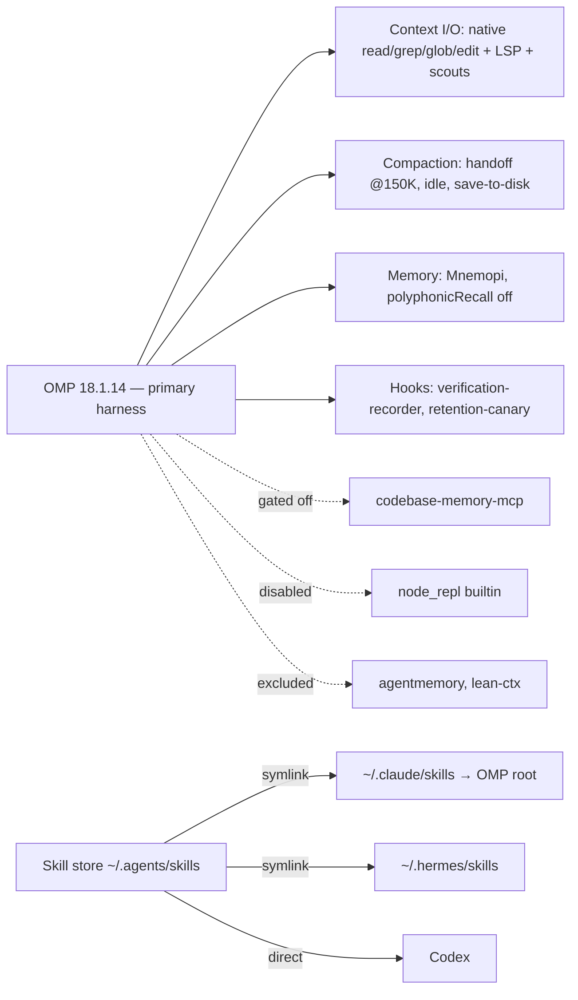

# Agent Stack — Decisions

> This is the only operative decisions doc. On 2026-08-19 it absorbed `AGENT_STACK.md` and `TOOLS_RESEARCH.md`, which were deleted. The frozen evidence ledger `AI_CONTEXT_TOOLING_COMPARISON.md` was deleted the same day; its git history keeps the full evidence, grades, and methods. Binding ADRs: `agentic-env/docs/adr/0006`–`0010`. Review standards: `CODING_STANDARDS.md`.
>
> Layout (2026-09-02): the summary table, then the measured rules every layer cites, then one section per layer in the order **Decided → Why → Rejected → Revisit → Wiring**, so each decision traces from evidence to config line. "Live wiring" holds the cross-cutting contract and "Upstream watch" the pre-registered triggers. Vocabulary: `docs/CONTEXT.md`.

## The stack

| Layer | Decided | Why | Alternatives | Revisit when |
|---|---|---|---|---|
| Harness | OMP | Best model + LSP + edit anchors | Hermes, Claude Code, opencode, Codex | Never unless OMP fails |
| Context I/O | OMP native only | Cache-stable, anchor-safe; compressors break edits | lean-ctx (removed, ADR-0009), Headroom, rtk | Native tools visibly fail |
| Compaction | handoff @ 150K, idle on, save-to-disk | −43–50% tokens, quality held | 120K threshold | End-green < 88% → revert |
| Memory | Mnemopi + retention-canary hook | Recall good, keyless, zero infra; canary covers silent-loss defect | Hindsight (sole challenger), mem0, agentmemory, Letta, Zep | Cross-project memory sharing needed → Hindsight |
| Code graph | codebase-memory-mcp gated off | Costs quality, 10× tokens | GitNexus, GraphRAG, Serena, etc. | Litmus fires weekly |
| Skills | Fit-curated roster (see Skills section): Pocock core + Ponytail forced + Caveman on demand + 12 pstack skills vendored | Fit-judged per recipe job; usage is diagnostic only | Full Pocock 25 + pstack 44 stores | A recipe step has no fitting skill; an Excluded trigger fires |
| Hooks | verification-recorder, retention-canary | Pass-rate read-outs; silent-memory-loss tripwire | cadence-governor (rejected 08-19), external monitoring | Recorder DB unread by next read-out; canary false-warns |

OMP is the primary harness, Hermes a supported agent, and Claude Code and Codex installed agents; see [Agent tiers](#agent-tiers-2026-09-02).

## Rules (measured; violations cost real money)

1. Judge by success-adjusted billed cost, never token reduction (correlation r=0.15).
2. Cache reads are ≈ 68.6% of the bill. A tool that can't touch cached re-reads can't move it.
3. No lossy compressor on the read→edit path. It corrupts edit anchors: patch success fell from 27/40 to 15/40.
4. One semantic-memory owner per agent. OMP LSP owns live symbol truth.
5. Wiring routes tools; prose doesn't. A prompt mandate repeated 3× got 15.6% adherence, and cadence-governor nudges got 16.4%, about chance.
6. Vendor claims measure at 1/8–1/3 of what is advertised, or negative. Adopt only on locally measured, pre-registered endpoints.
7. Decisions live in committed docs; memory is convenience.
8. The user adopts skills on workflow fit. Usage audits are diagnostic: they flag stale or duplicate skills for re-review and never gate adoption. Rule 6 governs tools only. `docs/CONTEXT.md` defines the usage units: user-invoked ≠ model-invoked ≠ string-scan.

Every rejection below names the pre-registered threshold it missed: lean-ctx 1 semantic call < 5; agentmemory 0 calls in 934 sessions; node_repl 0 calls; cadence-governor 16.4% adherence ≈ chance. The stack doctor enforces exactly what those verdicts left standing. The round 2 full-market sweep (17 tools, 08-11) adopted nothing, because no candidate ships third-party agent-on-repo evidence.

## Decisions by layer

### 1. Harness — OMP

- **Decided:** OMP, floor `18.1.14` (`stack_metadata.OMP_VERSION`). Release assets and contract settings were reviewed at `v18.1.14`; the installer hash is unchanged. The installer fetches the latest release binary and verifies the floor after install.
- **Why:** best model access, LSP, and edit anchors. The alternatives lost on tooling, not on model.
- **Rejected as primary:** Hermes, Claude Code, opencode, Codex. A paired OMP/Hermes benchmark is [parked](#parked).
- **Revisit:** never unless OMP fails. OMP major bump → re-verify the converge keys against `packages/coding-agent/src/config/settings-schema.ts` at the new tag, raise the floor, and re-run the docker smoke.
- **Wiring:** contract keys verified at the pinned tag: `memory.backend`, `compaction.{thresholdTokens,idleEnabled,handoffSaveToDisk,methodOrder}`, `skills.{enableClaudeUser,enableAgentsUser}`, `extensions`. The drift check is block-scoped (`OMP_AGENT_CONFIG_CONTRACT`), not a substring match. The `node_repl` built-in is disabled on both OMP roots (0 calls; `OMP_GATED_BUILTINS`, doctor-enforced). MCP servers and the skill roster bind at instance start, so after any `mcp.json` edit run `/mcp reload` or restart live omp instances.

#### Agent tiers (2026-09-02)

- **Primary harness — OMP.** Installer-enforced, smoke-verified, doctor failure.
- **Supported agent — Hermes.** Its CLI, skills, MCP config, and health checks are managed; the doctor only warns (`TODO secondary`). It keeps its `codebase-memory-mcp` and `agentmemory` entries (behaviour unmeasured).
- **Installed agent — Claude Code, Codex.** Latest CLI at or above the reviewed floor, plus curated skills from the skill store. No MCP config is written or diagnosed; the doctor warns only when the binary is missing.

#### Secondary agents TODO (closed 2026-09-02)

1. Hermes install correctness: **closed by `chore/agentic-env-bump-pins`**. Reviewed release v2026.8.31 (`0.21.0`, `29112bef`). `_install_hermes` converges fresh or outdated checkouts to `HERMES_COMMIT` and leaves a checkout at or above the floor alone; the installer refuses rollbacks without `--force-commit`.
2. `agentmemory` + `codebase-memory-mcp` wiring on Claude/Codex: **not pursued**. Claude Code and Codex are installed agents, and the measured need for managed wiring is zero (agentmemory 0 calls in 934 sessions, codebase-memory litmus 0×). Hermes keeps its entries; the `@agentmemory/mcp` shim is pinned to `AGENTMEMORY_VERSION`.
3. Codex per-tool approval filters: **not pursued**. There is no managed Codex MCP config to filter.
4. Claude/Codex pin refresh: **closed by `chore/agentic-env-bump-pins`**. Codex 0.152.1, Claude 2.1.258, agentmemory 0.9.29; installer script checksums re-verified unchanged.

### 2. Context I/O — OMP native only

- **Decided:** OMP-native `read`/`grep`/`glob`/`edit` + LSP + scout subagents. Nothing sits on the read→edit path.
- **Why:** Rules 2 and 3. Native tools are cache-stable and anchor-safe.
- **Rejected:**
  - lean-ctx: failed its own pre-registered threshold (1 semantic call < 5; ADR-0008 fallback). Removed stack-wide 2026-09-02 after containment failed twice (ADR-0009). `stack_metadata.py` keeps a reinstall pointer to ≥ 3.10.0, never 3.9.x, whose read-path default is lossy.
  - Headroom (+48.4% cost), rtk (wash), LLMLingua (degrades on code agents): rejected on third-party evidence.
  - Context Mode, mcp-compressor, OmniRoute, pxpipe: duplicate native tools, unproven, or unneeded. aider repomap and Repomix were not pursued.
- **Revisit:** grep+LSP+scouts visibly fail on a real task → context I/O re-shop (Parked). Semantic search visibly missing → reinstall lean-ctx ≥ 3.10.0 with an OMP-native gated entry (ADR-0009), never the claude-import path.
- **Wiring:** no config OMP loads may contain read-interception prose, including `~/.claude.json` `mcpServers.*.instructions`; the doctor greps for `ctx_` / `shadow mode` / `auto-route`. `lean-ctx` is purged **and** disabled on both OMP roots (`OMP_EXCLUDED_SERVERS`). It must be absent from `~/.claude.json` (mandatory), and a stale Hermes entry warns.

### 3. Compaction — handoff @ 150K, idle on, save-to-disk

- **Decided:** `handoff` at 150K tokens, idle compaction on, handoff saved to disk.
- **Why:** −43–50% tokens with quality held.
- **Rejected:** 120K threshold (same quality, less headroom). The `handoff-as-deliberate-habit` skill: compaction already handles fragmentation mechanically, while "remember to invoke at seams" is prose, and prose doesn't route (Rule 5).
- **Revisit:** end-green < 88% → revert.
- **Wiring:** `compaction.{thresholdTokens,idleEnabled,handoffSaveToDisk,methodOrder}` in `~/.omp/agent/config.yml` (backup `config.yml.bak-tuning`).

### 4. Memory — Mnemopi + retention canary (settled 2026-08-19)

- **Decided:** Mnemopi stays the default (user, 2026-08-11); the retention-canary hook covers its one defect.
- **Why:** recall is good, keyless, and needs zero infra. Stage 1 (08-11): zero-LLM Hindsight won the registered endpoint (decision-recall 1/4 @1,024 tok vs 0/4; cross-project isolation 4/4 PASS). Forensics (08-12) showed Mnemopi's 0/4 was a **silent retention gap**, not a recall failure, despite correct wiring. A Stage 1b replay on the populated bank reached ≈ parity (1 PASS + 3 PARTIAL; reflect works keyless). The gap differential (08-17) fixed the edges (retention worked through 07-14, was dead 07-19→08-10, and resumed 08-11) and ruled out version, cadence, config, drift, and hooks. The residual defects are opposite. Mnemopi silently loses retention, so the **retention canary was wired 08-18**; Hindsight's defect is recall budget (config). Full data: `docs/memory-backend-research.md`.
- **Rejected:**
  - agentmemory on OMP: 0 calls in 934 sessions, and ADR-0006 requires a single memory owner. It stays on Hermes.
  - Hindsight: the sole challenger. Cross-project sharing is the one thing Mnemopi structurally cannot do.
  - mem0, MemPalace, Letta, Zep: unproven claims, wrong lane, or paid-only.
  - Stage 2 bake-off: skipped (user, 2026-08-19). It was blocked on an OpenAI-compatible key, and Stage 1b parity plus the canary cover the residual risk. The research doc keeps the unblock paths if this reopens.
- **Revisit:** related-project memory sharing becomes a live need → Hindsight (vs mem0 bake-off). Upstream https://github.com/can1357/oh-my-pi/issues/8940 ships → retire the canary. That issue, filed 2026-08-19, reports the silent retention gap and differential and asks for retain-attempt telemetry.
- **Wiring:** `memory.backend: mnemopi`; `mnemopi.polyphonicRecall: false`. The key lives under `mnemopi.`, not `memory.` (same in 17.0.5); the template, host config, and drift check were fixed 2026-09-02. `agentmemory` is purged and disabled on both OMP roots and absent from `~/.claude.json`. Hermes: `mcp_servers.agentmemory` (`npx -y @agentmemory/mcp@<AGENTMEMORY_VERSION>`) + `memory.provider: agentmemory`.

### 5. Code graph — codebase-memory-mcp, wired but gated off

- **Decided:** installed and registered on both OMP roots, disabled by default; enabled per session only when the litmus fires.
- **Why:** costs quality and 10× tokens on ordinary tasks.
- **Litmus:** the task needs >10 native calls, crosses repo boundaries, or aggregates the whole graph → `/mcp enable` and a `fast` reindex. It has fired 0× since 08-05. Promotion: if it fires about weekly in a project, make it default-on there.
- **Rejected:** GitNexus, GraphRAG, cognee, Graphiti, Semantica, Serena: no coding evidence, license problems, or paid-only.
- **Revisit:** litmus 0× by **2026-10-01** → remove `codebase-memory-mcp` from the OMP roots (keep installed for per-project on-demand mounting). Upstream 0.11.0 available vs floor 0.9.0; bump only on promotion.
- **Wiring:** `mcpServers: {codebase-memory-mcp}` gated by `disabledServers: [agentmemory, node_repl, codebase-memory-mcp, lean-ctx]` on `~/.omp/agent/mcp.json` and `~/.pi/agent/mcp.json` (`OMP_GATED_SERVERS`; backups `mcp.json.bak-leanctx-drop`, `.bak-gate`). Hermes is wired too (unmeasured).

### 6. Skills

**38 curated skills:** 18 Matt, 12 pstack, six ponytail, two caveman. [The manifest](agentic_env/skill-packs.json) owns the roster and sources; [Matt](agentic_env/vendored/mattpocock/UPSTREAM.md) and [pstack](agentic_env/vendored/pstack/UPSTREAM.md) record provenance and adaptations. [Verification and research history](docs/skills-workflow-recheck-2026-09-21.md).

**Installation scope:** managed installations use the native skills CLI and agent skill roots. Custom-directory installation copies complete selected packages into one explicit folder; it selects no agent targets and registers no global provenance. The Python-only route copies the vendored subset offline and reports remote-only exclusions. It is the Windows copy path, not Windows stack provisioning. Both standalone routes refuse existing skill names, leave unrelated destination files intact, and leave package bodies unchanged. The [installation runbooks](README.md#choose-an-installation-path) own commands, prerequisites, and maintenance.

**Source drift:** `agentic-skill-drift` (read-only) compares each curated skill with its pack source, with its reviewed fingerprint in `agentic_env/skill-fingerprints.json`, and upstream at the pinned revision with upstream today. Its installed comparison covers the canonical managed store, not arbitrary standalone destinations. Vendored adaptations never count as drift, because the upstream comparison is upstream-to-upstream. It exits 1 on a moved tag, an unreviewed vendored edit, a missing or locally modified install, or an install that the skills CLI lockfile attributes to another pack. Packs still move only by reviewed tags or vendored updates. Re-record the baseline with `--update-baseline` as part of that review, never to silence a finding.

**Routing, not a pipeline.** Small known changes stay direct: implement and exercise the affected path. Core methods apply only to their named job; escalation needs the stated trigger. See the [practical routing guide](guides/skill-routing.md) and [new-project workflow](guides/poteto-workflow.md).

| Job | Core | Escalation → work product |
|---|---|---|
| Requirements and interfaces | `grilling`, `grill-with-docs`, `domain-modeling`, `codebase-design` | External facts → `research`; uncertain interaction → `prototype`; multi-session decisions → `wayfinder` |
| Implementation and bugs | Matt `tdd` when test-first is requested; `diagnosing-bugs` for failures | Lifecycle/shared-state/downstream risk → `blast-radius` executed safety proof |
| Review | `code-review`: Standards + Spec | Consequential residual uncertainty → `interrogate` independent critique |
| Understanding | `how`: current mechanism | Historical intent → `why`; mechanism and rationale explained together → pstack `teach`; unclear explanation → `wait-what` |
| Style | Force-injected ponytail bundle | Requested terse output → caveman; prose cleanup → `unslop`, never globally injected |

Other escalations: `to-spec`/`to-tickets` for durable plans; `handoff` for explicit transfer; `resolving-merge-conflicts` for an active conflict; `improve-codebase-architecture` for report-only surveys; `show-me-your-work` for run audits; `reflect` for costly detours; `recall` for scoped transcripts, not the memory bank. Agent documents use `writing-for-agents`; substantial human-facing material uses `technical-writing`. `wizard` requires approved stages and destinations and human execution, and never inspects secret files.

**Invocation:** all pstack skills are manual-only, as are Matt's `grill-with-docs`, `handoff`, `improve-codebase-architecture`, `to-spec`, `to-tickets`, `wait-what`, `wayfinder`, `wizard`. Other Matt methods keep narrow automatic triggers. Explicitly invoked recipes may load named dependencies; role labels grant no invocation or action authority.

**Managed runtime:** `~/.agents/skills` is canonical; Claude and Hermes link to it. OMP loads the Claude root (`enableClaudeUser: true`, `enableAgentsUser: false`). It hides manual skills from its automatic listing but still loads them by name. Installed Hermes ignores the manual flag and warns on those symlink targets, then loads them successfully, so the body guards are behavioral, not enforced hiding. Do not weaken trust to suppress the warnings. Standalone copies create none of these links and do not enroll another harness in managed discovery, health checks, or updates.

**Review:** freeze explicit refs or scoped WIP into a snapshot. The snapshot includes intended committed, staged, unstaged, and untracked changes, captured through a temporary Git index and object database without altering the user's staging. Both reviewers read that snapshot. Verify its hashes before and after, and keep prompts and results outside it. Hashes are not a sandbox. Restricted grants or tool-less input enforce read-only review. A multi-model claim requires two distinct provider/model identities that each returned successfully; report substitutions and failures.

**Verification:** reuse existing drivers. Create `.agents/skills/verify-<app>` only when needed, and prove one mapped feature with it. Explicit maintenance exercises every mapped feature, edits only the verifier, and reports product regressions. Ordinary changes check the affected paths. OMP discovers project skills; Hermes requires explicit project trust.

**Exclusions:** `implement` adds an unwanted orchestrator and an unconditional commit. `bro` duplicates the chosen `wait-what`. Public `tdd` remains Matt's and does not fold in pstack's contract. Public `teach` uses pstack's engineering explanation through `how`/`why`; Matt's sustained learning workspace is no longer selected or vendored. Reopen `architect`/`arena` only for expensive competing designs with a design-only stop. Reopen `swarm` only when a coverage method is needed; native fan-out is not equivalent. Beta schedulers and retrospectives require maturity and a specific job. Principles belong in standards, not another installed pack. Duplicate style and interview methods stay excluded. Every other unlisted skill needs a deliberate adoption decision. Local `graphify` remains outside the packs.

Branch creation, commits, pushes, PRs, tracker writes, infrastructure changes, and credential changes each need their own authorization. Revisit the roster when a named job lacks a method. [The prior contract](https://github.com/MihaiA24/.dotfiles/blob/0a827c85d89e3737cca03f20eb5a17c3c1b117fe/agentic-env/DECISIONS_AI_TOOLING.md) keeps the complete historical rationales.

### 7. Hooks — verification-recorder + retention-canary

- **Decided:** two hooks, `omp/hooks/verification-recorder.ts` and `omp/hooks/retention-canary.ts`.
- **Why:** pass-rate read-outs (OMP 527 verifications @ 87.3% pass; dedicated event tables beat string scans) and a silent-memory-loss tripwire (layer 4).
- **Rejected:**
  - cadence-governor (2026-08-19, measured non-adherence). Across 589 session logs, the verification nudge got 16.4% adherence within 10 calls, declining by fire number (17.5% → 10.6% → 8.7%). That is at or below the ~22% chance that any 10-call window contains a verification command. The overwrite steer got a 15% immediate switch (n=20). The 08-11 read-out's sole positive signal (first fire: 59% verified within 25 calls) came with 60% of all fired nudges being spam beyond N=75; the 3-strike cap treated the symptom. Prose doesn't route (Rule 5). Reopen bar: a mechanism that routes (blocks or redirects) rather than nudges.
  - External monitoring: no mechanism inside the harness.
- **Revisit:** recorder DB unread by the next read-out; canary false-warns; canary fire-rate on 18.1.x read at the next read-out (zero fires and #8940 still open = keep); #8940 ships → retire the canary.
- **Observation (2026-09-09) → resolved 2026-09-15 (#43):** the canary reported an empty or never-retained bank while `recall` returned memories from it. Cause: `episodic_memory.created_at` is ISO `T…Z`, while `working_memory`/`facts` use `YYYY-MM-DD HH:MM:SS`. The lexical SQL `max()` over the union picked the ISO row, the parser appended a second `Z`, `Date.parse` returned `NaN`, and `null` read as "never". The canary therefore fired in every project with one episodic memory and two sessions. Fix: `max(julianday(created_at))`, which parses both formats and orders them numerically, with a regression test in `retention-canary.test.ts`. This closes the "canary false-warns" Revisit trigger, which had fired. The 07-19→08-10 gap the canary guards remains real.
- **Wiring:** each hook is registered exactly once in `extensions:` with its file present (doctor-enforced). Hook files are diagnosed, never written (machine-provisioning boundary). The installer finds them via `$AGENTIC_DOTFILES_ROOT`, then `~/.dotfiles`, then the cwd/package ancestors. It refuses to seed `config.yml` without them, because a half-seeded config becomes three doctor failures later.

## Live wiring (this machine)

The mandatory contract is the OMP layer. It is installer-enforced (`agentic-configure-agent-mcps`), smoke-verified (`docker-smoke-test.sh`), and diagnosed by `agentic-stack-doctor`. The doctor is read-only and exits 1 only on an OMP check; Hermes wiring and the Hermes/Claude/Codex binaries warn with a TODO tag. It runs as the last phase of `agentic-bootstrap` and `agentic-update-stack`.

- Clean-host contract (2026-09-02; version floors 2026-09-16): `uv tool install --force . && agentic-bootstrap` on a host with a `~/.dotfiles` checkout yields exactly this stack. Reviewed versions are **floors**, not pins (`STACK_VERSION_FLOORS`). Installers fetch the latest release and verify it is at or above the floor, so a host ahead of the review is compliant and a host below it is a doctor failure. Skill, MCP, and hook drift is never tolerated. Two components are still fetched at a fixed identity because their fetch path cannot be trusted to float: the Hermes installer (commit `95d42656`, #39) and the codebase-memory-mcp release archives (per-arch SHA256). Remote scripts stay hash-pinned regardless. The npm references install `@latest` and carry a written contract reason (`remote_install_contract`).
- Fresh-machine reproducibility: `agentic-configure-agent-mcps` seeds `~/.omp/agent/config.yml` from this contract when it is absent and verifies it when present (`converge_omp_agent_config`). Existing user YAML is never rewritten.
- Configuration ownership (2026-09-10): existing MCP definitions are notify-only. Missing entries are added. Mismatched commands or arguments and Hermes memory-provider conflicts are reported for manual correction; the affected file is not rewritten. Existing OMP settings YAML stays read-only. The explicit OMP exclusion and default-gating policy is unchanged, and it grants no general repair authority.
- Hermes severity split (2026-09-13): `agentic-configure-agent-mcps` hard-fails on Hermes drift, because it refuses an unsafe write to a user-owned file. `agentic-stack-doctor` only warns for Hermes, because it diagnoses a secondary agent and its exit code reflects the OMP contract.
- Acceptance scope (2026-09-10): native Apple Silicon macOS and Arch Linux x86_64, plus the existing Debian container. Intel macOS is out of scope; direct CachyOS verification is deferred. An Arch run is Arch-family proxy evidence, not a verified CachyOS run. The README records successful runs and exact OS/architecture coverage.
- Windows scope (2026-09-22): native CI verifies only the dependency-free vendored-skill copier. It does not extend clean-host provisioning acceptance, validate the native skills CLI on Windows, or prove that copied skill workflows work on Windows. The README records the separate [copy acceptance evidence](README.md#ci-and-recorded-evidence).
- The concrete settings are the **Wiring** line of each layer above: harness (pin, contract keys, `node_repl`), context I/O (excluded servers, prose ban), compaction (`compaction.*`), memory (`memory.backend`, `mnemopi.polyphonicRecall`), code graph (`mcp.json` gate), skills (`skill-packs.json`, `skills.enableClaudeUser`, `skills.enableAgentsUser`), hooks (`extensions`).

## Upstream watch

These are pre-registered triggers. Nothing here is acted on until its trigger fires. Layer triggers repeat that layer's **Revisit** line; the installer, skill-pack, screening, and version-review entries appear only here.

- oh-my-pi #8940 (retain-attempt telemetry) ships → retire the retention canary.
- OMP major bump → re-verify converge keys against `settings-schema.ts` at the new tag, raise the floor, re-run the docker smoke.
- Hermes installer (2026-09-15, #39): fetched at commit `95d42656` of `NousResearch/hermes-agent` (the bytes reviewed 2026-09-02). It is never fetched from the floating `hermes-agent.nousresearch.com/install.sh`, which drifted 2026-09-13 and turned every acceptance job red. Hermes pin bump → move `HERMES_INSTALL_COMMIT` with it and re-verify the SHA256. `omp.sh/install` and `claude.ai/install.sh` remain floating and hash-pinned; on their first drift, apply the same treatment if the vendor publishes a versioned URL.
- OMP installer (2026-09-15; re-scoped 2026-09-16): at the pinned SHA, `scripts/install.sh:245` looks up the release on `api.github.com` unauthenticated. The installer now runs without `--ref`, so that lookup is load-bearing rather than redundant. Shared `macos-15` runner IPs exhaust the 60 req/h limit, which yields `curl 403` and a red macOS acceptance job while Debian/Arch pass (six in a row 21:05–21:45 UTC on 2026-09-15). This is not fixable here: `clean-acceptance.sh` forbids credentials in the smoke HOME by contract. Drop this line when upstream honours `GITHUB_TOKEN` or serves an unauthenticated latest-release redirect, and re-verify `OMP_INSTALL_SHA256` then. Until then, a red macOS job with that transcript is a re-run, not a defect.
- Canary fire-rate on 18.1.x → read at the next read-out; zero fires and #8940 still open = keep.
- codebase-memory litmus 0× by **2026-10-01** → remove `codebase-memory-mcp` from the OMP roots (keep installed for per-project on-demand mounting). Upstream 0.11.0 available vs floor 0.9.0; bump only on promotion (the archives are checksum-pinned, so this one does not float).
- mattpocock `retro` maturity becomes unambiguous → fit audit against pstack `reflect`; do not infer graduation from a substantive body while the beta index still says stub.
- Matt/pstack update → review the source, complete the assets, and reapply adaptations, following each pack's `UPSTREAM.md`. A new tag alone does not replace the native invocation, scope, and authority contracts.
- lean-ctx need fires (semantic search visibly missing on a real task) → reinstall ≥ 3.10.0 per ADR-0009.
- Cross-project memory becomes a live need → Hindsight vs mem0 bake-off.
- Trendshift screening: **Retired** as a routine (0 adoptions across two sweeps); on-demand reruns only.
- Version review → set every entry in `STACK_VERSION_FLOORS` to the latest stable release at the time of review, then re-run the acceptance matrix. Floors move on review, never on a single host's install.

## Parked

- Paired OMP/Hermes benchmark — only if OMP-primary ever needs to be definitive.
- Context I/O re-shop — only when grep+LSP+scouts visibly fail on a real task.
